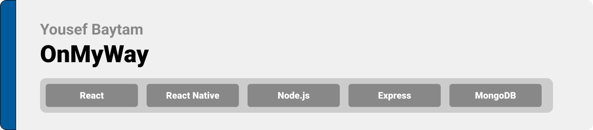
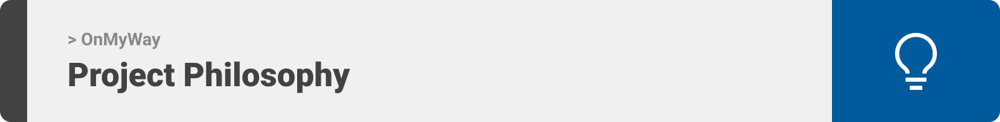
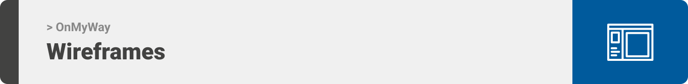
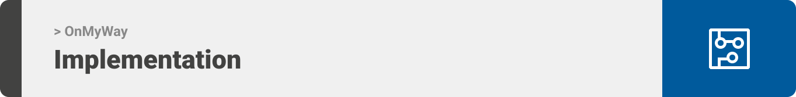

<div align="center">

> Hello world! OnMyWay is a carpooling app that connects people with similar commute routes based on their personal preferences  


**[PROJECT PHILOSOPHY](https://github.com/Yousef-Baytam/final_project#project-philosophy) • [WIREFRAMES](https://Yousef-Baytam/final_project_app#wireframes) • [TECH STACK](https://Yousef-Baytam/final_project_app#tech-stack) • [IMPLEMENTATION](https://Yousef-Baytam/final_project_app#impplementation) • [HOW TO RUN?](https://Yousef-Baytam/final_project_app#how-to-run)**

</div>

<br><br>




> OnMyWay was designed to be your trusted go-to app whenever you are tight on money, unable to drive, or just simply looking for a travel companion to find a ride or someone to join you on your ride.
> 
> There are multiple criteria one can benefit from to find the perfect companion for their trips like gender, music preferences, and car model, besides the obvious ones like the trip date/time, route, and destination.

<br>

### User Stories
- As a user, I want to personalize my profile, so I can find joiners matching my preferences
- As a user, I want to post my one time or on schedule trips
- As a user, I want to reach out to people, and chat with them, so I can communicate any necessary detail about the trip
- As a user, I want to be able to report and block/unblock other users
- As a user, I want to have different color themes for my app theme
- As a user, I want to get notifications when someone request to join my rides or when I get a new message
- As a user, I want to be able to accept or reject other users join requests
- As a user, I want to be able to search and/or filter posts
- As a user, I want to review other users, check their and my reviews
- As a user, I want to be able to check my current and history, offered and joined rides

<br>

### Admin Stories
- As an admin, I want to check the pending user submitted reports and mark them as reviewed
- As an admin, I want to filter reports by their status (pending/ reviewed)
- As an admin, I want to view all the users on the platform and have the ability to ban and activate users
- As an admin, I want to filter users by their status (active/ banned)

<br><br>



> This design was planned before on paper, then moved to Figma app for the fine details.
Note that i didn't use any styling library or theme, all from scratch

| Login | Register  | Browse  |
| -----------------| -----|-----------------|
|  |  | |

| My Profile  | User Profile  | Chat  |
| -----|-----------------| -----|
|  |  |  |

| New Post  | Post  | Map  |
| -----------------| -----| -----------------| 
|  |  |  | 


<br><br>


Here's a brief high-level overview of the tech stack, tools, and packages the OnMyWay app uses:

- This project uses the [React Native app development Library](https://reactnative.dev/). React Native is a JavaScript library for writing real, natively rendering mobile applications for iOS and Android. It’s based on React, Facebook’s JavaScript library for building user interfaces, but instead of targeting the browser, it targets mobile platforms.
- For persistent storage (database), the app uses the [MongoDB](https://www.mongodb.com/) package which allows the app to create a custom storage schema and save it to a database.
- This project uses [Node.js development platform](https://nodejs.org/en/) and [Express web application framework](https://expressjs.com/) as a backend technology along with [Mongoose](https://mongoosejs.com/) as a ODM library for MongoDB.
- This project uses [Firebase development platform](https://firebase.google.com/) to connect to [Firestore ](https://firebase.google.com/products/firestore) to create chat-rooms, store, get messages, and track unread messages in real time for the live chatting feature.
- [Cloudinary cloud storage](https://cloudinary.com/) was used to store, and manage user profile pictures for this project.
- [JSON Web Tokens](https://jwt.io/) which is an open standard used to share security information between two parties; a client and a server and [Passport authentication middleware](https://www.passportjs.org/) (passport-jwt strategy) were used to issue and validate JWT tokens for users authentication.
- [joi](https://joi.dev/) and [yup](https://github.com/jquense/yup) validations were used to validate the data traffic on the project backend and frontend respectively.
- [react-navigation](https://reactnavigation.org/), [react-navigation/stack](https://reactnavigation.org/), [react-navigation/drawer](https://reactnavigation.org/), and [react-navigation/bottom-tabs](https://reactnavigation.org/) were utilised and nested to create the project navigation system.
- This project uses [react-native-maps](https://github.com/react-native-maps/react-native-maps) to fetch and access google maps, [expo-location](https://docs.expo.dev/versions/latest/sdk/location/) to get the user location and use it as an initial location on map render, and [react-native-google-places-autocomplete](https://github.com/FaridSafi/react-native-google-places-autocomplete) for allow the user to search and "fly to" locations around him (currently inactive; needs google places API key which we couldn't obtain dueto billing account restrictions)
- [expo-notifications](https://docs.expo.dev/versions/latest/sdk/notifications/) was used to get user notification permission, get expo push token, set notification channel and add notification listeners.
- [react-native-gifted-chat](https://github.com/FaridSafi/react-native-gifted-chat) was used as the main tool to create the live chatting system and interface.
- [react-native-async-storage/async-storage](https://github.com/react-native-async-storage/async-storage) and [react-native-storage](https://www.npmjs.com/package/react-native-storage) were used to initialse the local stroage to store and retrieve the authentication JWT token and the user theme of choice.
- [expo-camera](https://docs.expo.dev/versions/latest/sdk/camera/) and [expo-image-picker](https://docs.expo.dev/versions/latest/sdk/imagepicker/) were used to allow the user to access his gallery or capture a new image to use it as his profile picture.
- [react-native-paper-dropdown](https://fateh999.github.io/react-native-paper-dropdown/#/), [expo-checkbox](https://docs.expo.dev/versions/latest/sdk/checkbox/), [react-native-phone-input](https://github.com/rili-live/react-native-phone-input), and [react-native-community/datetimepicker](https://github.com/react-native-datetimepicker/datetimepicker) were used to create the different needed user data inputs on register, and update of the user info, and on creation of a new post.
- [react-native-svg](https://github.com/react-native-svg/react-native-svg) was used to create custom svgs (the ones used in the design phase on Figma)
- [Moment.js](https://momentjs.com/) was used for easier handling and prettier formating of date and time.
- [react-native-ratings](https://github.com/Monte9/react-native-ratings) was used to create the star-rating component used in the review system of this project

<br><br>


> Uing the above mentioned tecch stacks and the wireframes build with figma from the user sotries we have, the implementation of the app is shown as below, these are screenshots from the real app

| Login | Register  | Browse |
| -----------------| -----|-----------------|
|  |  |  |

| My Profile | Updatig Profile Pic  | User Post and Profile |
| -----------------| -----| -----------------|
|  |  |  |

| Contact/Chat  | Report a User  | Block a User |
| -----------------| -----| -----------------|
|  |  |  |

| Unblock a User | Add a Review  | Update a Review  |
| -----------------| -----| -----|
|  |  |  |

| Add a Post  | Accepted Join Requests | Rejected Join Requests |
| -----------------| -----| -----|
|  |  |  |

| New Message Notification | Join Request Notification  |  Dark Theme  |
| -----------------| -----| -----|
|  |  |  |

<br>

| Admin Pannel Users |
| -----------------|
|  |

| Admin Pannel Reports  |
| -----|
|  |

<br><br>


To get a local copy on OnMyWay up and running follow these simple steps.

### Prerequisites

* npm
  ```sh
  npm install npm@latest -g
  ```

* expo-cli
  ```sh
  npm install -g expo-cli
  ```

* MongoDB installation guide
  ```sh
  https://www.mongodb.com/docs/manual/installation/
  ```

### Installation


1. Clone the repo
   ```sh
   git clone https://github.com/Yousef-Baytam/onmyway_final_project.git
   ```
2. Install NPM packages for onmyway_backend, onmyway_frontend, and onmyway_admin
   ```sh
   npm install
   ```
3. Add your Firestore config to the environment variables in onmyway_frontend
   ```js
   firebaseApiKey="firebaseApiKey"
   authDomain="authDomain"
   projectId="projectId"
   storageBucket="storageBucket"
   messagingSenderId="messagingSenderId"
   appId="appId"
   measurementId="measurementId"
   ```
4. Add your Cloudinary config to the environment variables in onmyway_backend
   ```js
   CName="CLOUDINARY_CLOUD_NAME"
   CKey="CLOUDINARY_KEY"
   CSecret= "CLOUDINARY_SECRET"
   ```
5. Add a JWT secret to the environment variables in onmyway_backend
   ```js
   JWT_TOKEN_SECRET="this is your secret"
   ```
6. a. Login to your expo account (a requirment for expo go push notifications)
   ```sh
   expo login
   ```
6. b. Setup FCM for push notifications (a requirment for the standalone app push notifications) 
   ```sh
   https://docs.expo.dev/push-notifications/using-fcm/
   ```
7. Start onmyway_backend and onmyway_frontend
   ```sh
   npm start
   ```


